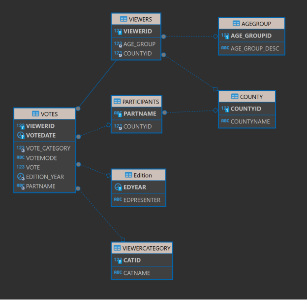

# Initial Dataset Description

A TV production company is interested in analyzing some statistics related to an annual music contest in Ireland.
During the last 10 years, the company has collected information about televoting from its viewers. The company
now wishes to analyze trends related to the viewers’ activity over several years. It also wishes to investigate
using a relational database, document store or distributed column store to achieve this.

The schema of the database the TV company current is shown below:

For each participant their name and county of residence is stored (or if the participant is a band, the county they
where they formed the band). Consider the participant’s name to be unique inside the database.
Votes in favor of each participant are given by viewers. The age group (i.e. 18-25, 25-30, 30-50, >50), category
(‘experts jury’ or ‘audience’) and county of residence are stored for the viewers.

The date when votes are expressed. Time is encoded in the following format: ‘hh:mm’ (hour, minutes).
The televoting mode is also known (i.e. Phone, Facebook, Instagram, TV program website). Each viewer can vote
using multiple modes. Each viewer can vote for five participants in each edition allocating a vote for each from 1
to 5 but they are not required to use all their votes, they can for example simply vote for one participant giving a
vote of 3 if they wish.

Each vote is associated to a specific edition of the TV program (e.g. ‘2020’, ‘2021’, ...). The TV program is
conducted in January. Since it is possible to vote only for the current edition, the year when the vote is
expressed corresponds to the year of the edition.

Finally, for each edition of the programme, the name of the presenter is known.
