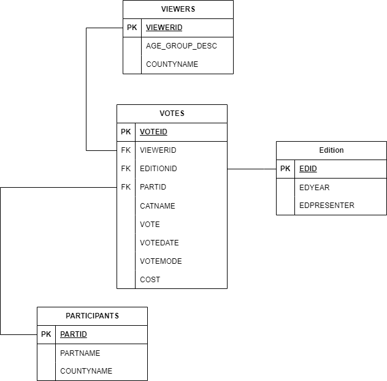
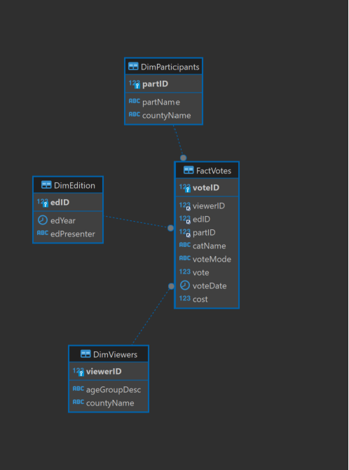

# Technologies used
    - GitBash
    - VSC 
    - DBeaver
    - Docker

# What this folder contains

## SQL to create the database (Star Schema) in MariaDB based on the dimensional model derived
  - MusicCompDimSetup.sql

## Code for ETL to populate database from the original data
  - MusicCompStagingLoad.sql
    - Stages all dims 
  - VotesFactStaging.sql
    - Stages the fact table (vote)
  - loadToDims.sql
    - Loads data from all stages to dims

## SQL to implement the queries 
  - Queries.sql

## SQL to implement any indexes introduced to improve query performance
  - indexQuery.sql
    - Contains the script used to run MariaDB
    - Contains the scripts used to check query performance
    - Contains the script used to create an index

## SQL needed to demonstrate the performance pre and post implementation of any indexes
  - indexQuery.sql
    - Contains the script used to run MariaDB
    - Contains the scripts used to check query performance
    - Contains the script used to create an index

## Code needed to create and populate an equivalent CouchDB database (shell script)
  - exportToJSON.sql
    - SQL query used to export as JSON from DBeaver
    - Contains the script used to import resulting JSON to couch DB
  - fact_votes.json
    - Exported JSON from query and DBeaver
  
## Code needed to implement a simple query against the equivalent of the fact table in this CouchDB
  - catNameIndex.JSON
    - Contains Mango Query to create an index
  - mangoQueryCatName.JSON
    - Query to find all Jury instances, displaying the participant name they voted for, their voting mode, sorted by category name
  - design_doc.json
    - The design doc result when the query is ran

# Initial Dataset Description

A TV production company is interested in analyzing some statistics related to an annual music contest in Ireland.
During the last 10 years, the company has collected information about televoting from its viewers. The company
now wishes to analyze trends related to the viewers’ activity over several years. It also wishes to investigate
using a relational database, document store or distributed column store to achieve this.

The schema of the database the TV company current is shown below:

For each participant their name and county of residence is stored (or if the participant is a band, the county they
where they formed the band). Consider the participant’s name to be unique inside the database.
Votes in favor of each participant are given by viewers. The age group (i.e. 18-25, 25-30, 30-50, >50), category
(‘experts jury’ or ‘audience’) and county of residence are stored for the viewers.

The date when votes are expressed. Time is encoded in the following format: ‘hh:mm’ (hour, minutes).
The televoting mode is also known (i.e. Phone, Facebook, Instagram, TV program website). Each viewer can vote
using multiple modes. Each viewer can vote for five participants in each edition allocating a vote for each from 1
to 5 but they are not required to use all their votes, they can for example simply vote for one participant giving a
vote of 3 if they wish.

Each vote is associated to a specific edition of the TV program (e.g. ‘2020’, ‘2021’, ...). The TV program is
conducted in January. Since it is possible to vote only for the current edition, the year when the vote is
expressed corresponds to the year of the edition.

Finally, for each edition of the programme, the name of the presenter is known.

# Target Star Schema

# Fact Votes Diagram

